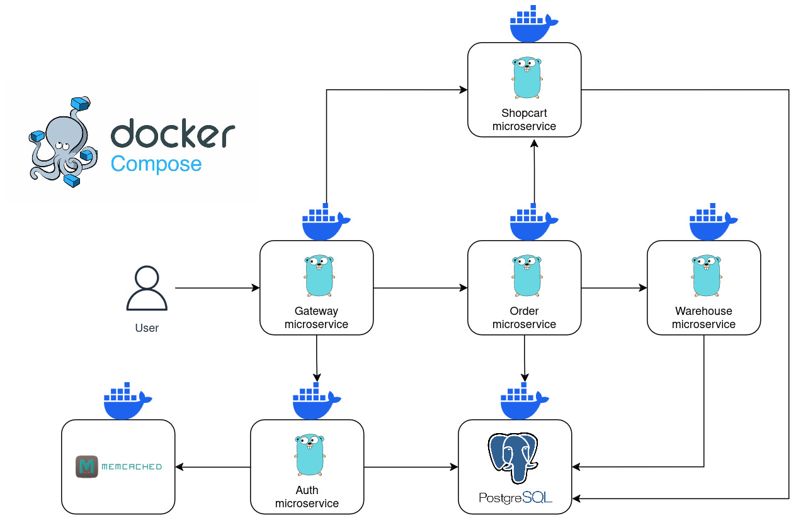

# market

## About The Project

This project is the implementation of the backend of an online store, using a microservice architecture
Technologies used:

- [Golang](https://go.dev/), [Gin](https://gin-gonic.com/), [Goose](https://github.com/pressly/goose)
- [PostgreSQL](https://www.postgresql.org/), [Memcached](https://memcached.org/)
- [gRPC](https://grpc.io/), [REST](https://ru.wikipedia.org/wiki/REST)
- [JWT Authentication](https://jwt.io/)
- [Docker](https://www.docker.com/), [Docker Compose](https://github.com/docker/compose)

---

## Project Structure

1. [gateway](/services/gateway-msv/README.md) - the gateway service is an entry point in the application and is responsible for processing HTTP REST requests
2. [auth](/services/auth-msv/README.md) - the authentication and authorization service
3. [shopcart](/services/shopcart-msv/README.md) - the service responsible for the user's shopping cart
4. [order](/services/order-msv/README.md) - the order service that handles the lifecycle of an order
5. [warehouse](/services/warehouse-msv/README.md) - the warehouse service that stores information about goods



---

## Getting Started

This is an example of how you may give instructions on setting up your project locally. To get a local copy up and running follow these example steps.

### Installation

1. Clone the repo

   ```sh
   git clone https://github.com/OsipyanG/market.git
   ```

2. Set environment variables

   - `services/gateway-msv/.env`
   - Copy the values from `services/gateway-msv/.env-example`
   - `services/auth-msv/.env`
   - Copy the values from `services/auth-msv/.env-example`
   - `services/order-msv/.env`
   - Copy the values from `services/order-msv/.env-example`
   - `services/shopcart-msv/.env`
   - Copy the values from `services/shopcart-msv/.env-example`
   - `services/warehouse-msv/.env`
   - Copy the values from `services/warehouse-msv/.env-example`

3. Go to the directory `services`

   **Before proceeding to the next step, make sure that you have Docker and Docker compose installed**

4. Build and run the project using `make`.

   ```sh
   make up
   ```

5. Run the `services/db/migrations/init.sql` script to create databases in PostgreSQL

   **Before proceeding to the next point, make sure that you have the [goose](https://github.com/pressly/goose) database migration program installed on your system.**

6. Run a script that will roll out migrations and create tables for each service. To do this, use the command.

   ```sh
   make migrate-up
   ```

---

### Usage

Now you can test this service by sending HTTP requests to the Gateway service, which runs on the port specified in `services/gateway-msv/.env`
